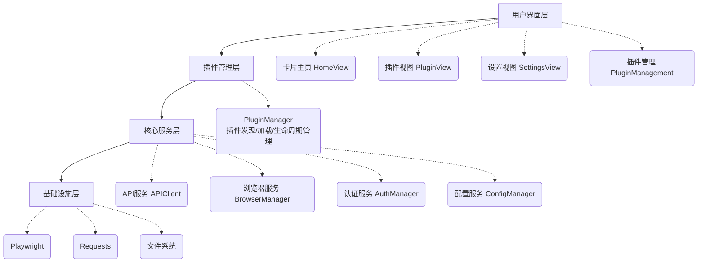
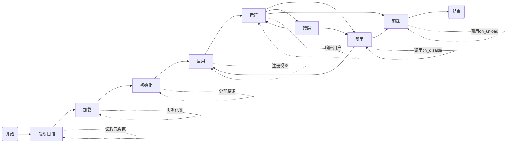
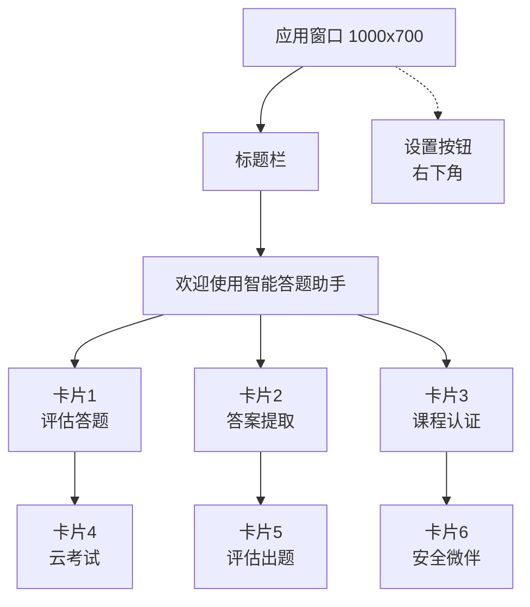
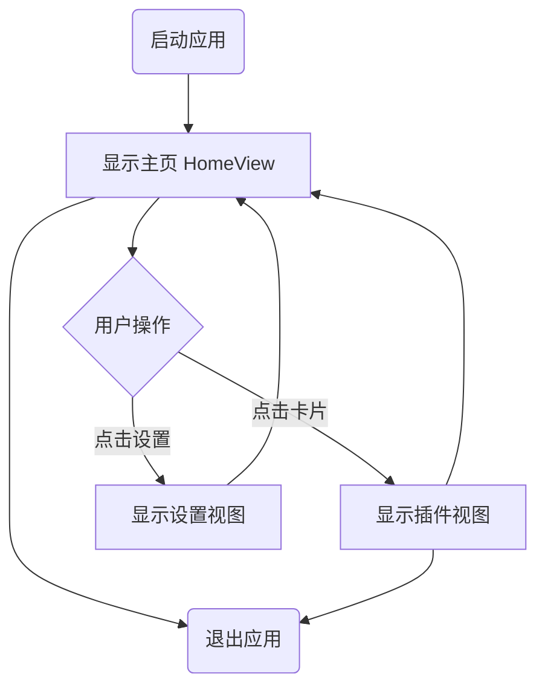

# ZX Answering Assistant 技术设计文档 v3.0

**文档版本**: 3.0
**编写日期**: 2026-04-20
**项目代号**: ZX-AA-Plugin
**文档状态**: 设计阶段

---

## 📋 目录

1. [项目概述](#1-项目概述)
2. [架构设计](#2-架构设计)
3. [插件系统](#3-插件系统)
4. [UI系统重构](#4-ui系统重构)
5. [核心服务接口](#5-核心服务接口)
6. [数据结构设计](#6-数据结构设计)
7. [配置管理](#7-配置管理)
8. [安全设计](#8-安全设计)
9. [开发规范](#9-开发规范)
10. [测试策略](#10-测试策略)
11. [部署方案](#11-部署方案)
12. [实施计划](#12-实施计划)

---

## 1. 项目概述

### 1.1 项目背景

ZX Answering Assistant 是一个基于 Playwright 的自动化答题系统，当前版本（v2.x）采用单体架构，所有功能模块耦合在一起。随着功能增多（课程认证、云考试、评估出题、安全微伴等），项目面临以下问题：

- **代码臃肿**: 主程序代码量超过3000行
- **维护困难**: 修改一个功能可能影响其他模块
- **扩展性差**: 新增功能需要修改核心代码
- **UI不够直观**: 左侧导航栏占用空间，功能不够一目了然

### 1.2 重构目标

**核心目标**：将单体架构改造为**插件化架构**，实现高内聚、低耦合、易扩展的代码结构。

**具体目标**：

1. **插件化系统**

   - 核心功能与扩展功能分离
   - 插件可独立开发、测试、维护
   - 支持运行时动态加载插件
2. **UI现代化**

   - 去除左侧导航栏，采用卡片式主页
   - 每个插件对应一个卡片，点击进入详细界面
   - 右下角浮动设置按钮
3. **插件管理**

   - 设置页面集成插件管理界面
   - 支持启用/禁用插件
   - 一键打开插件目录，方便用户安装
4. **统一基础设施**

   - 插件共享核心服务（API、浏览器、配置）
   - 统一的速率控制和错误处理
   - 规范的开发接口

### 1.3 技术栈

| 类别         | 技术        | 版本要求  |
| ------------ | ----------- | --------- |
| 编程语言     | Python      | ≥ 3.10   |
| UI框架       | Flet        | ≥ 0.80.0 |
| 浏览器自动化 | Playwright  | ≥ 1.57.0 |
| HTTP客户端   | Requests    | ≥ 2.31.0 |
| 版本管理     | Packaging   | ≥ 21.0  |
| 打包工具     | PyInstaller | ≥ 6.0    |

### 1.4 设计原则

1. **单一职责原则**: 每个模块/插件只负责一个功能领域
2. **开闭原则**: 对扩展开放，对修改关闭
3. **依赖倒置原则**: 插件依赖抽象接口，不依赖具体实现
4. **接口隔离原则**: 插件只依赖需要的服务接口
5. **最小知识原则**: 插件之间不直接通信，通过核心服务协调

---

## 2. 架构设计

### 2.1 整体架构



**架构分层说明：**

| 层级 | 职责 | 主要组件 |
|------|------|----------|
| **用户界面层** | 用户交互和界面展示 | HomeView, PluginView, SettingsView |
| **插件管理层** | 插件发现、加载、生命周期管理 | PluginManager, PluginBase |
| **核心服务层** | 为插件提供共享的基础服务 | APIClient, BrowserManager, AuthManager, ConfigManager |
| **基础设施层** | 底层技术支撑 | Playwright, Requests, 文件系统 |

### 2.2 目录结构

```
ZX-Answering-Assistant-python/
│
├── main.py                          # 应用程序入口
├── version.py                       # 版本信息
├── requirements.txt                 # 依赖列表
├── build.py                         # 构建脚本
│
├── docs/                            # ⭐ 文档目录
│   ├── TECHNICAL_DESIGN.md         # 技术设计文档（本文档）
│   ├── PLUGIN_DEVELOPMENT.md       # 插件开发指南
│   └── API_REFERENCE.md            # API参考手册
│
├── src/
│   ├── __init__.py
│   │
│   ├── core/                       # 核心服务层
│   │   ├── __init__.py
│   │   ├── plugin_core.py         # ⭐ 插件可调用的核心服务接口
│   │   ├── plugin_manager.py      # ⭐ 插件管理器
│   │   ├── api_client.py          # API客户端（带速率限制）
│   │   ├── browser.py             # 浏览器管理器
│   │   ├── config.py              # 配置管理器
│   │   ├── constants.py           # 常量定义
│   │   └── app_state.py           # 应用状态管理
│   │
│   ├── plugins/                    # ⭐ 插件系统基类
│   │   ├── __init__.py
│   │   ├── base.py                # 插件基类（PluginBase）
│   │   ├── manager.py             # 插件管理器实现
│   │   └── registry.py            # 插件注册表
│   │
│   ├── plugins_extensions/         # ⭐ 插件目录（用户可安装）
│   │   ├── _template/             # 插件模板
│   │   │   ├── plugin.py
│   │   │   ├── ui/
│   │   │   │   └── view.py
│   │   │   ├── workflow.py
│   │   │   └── README.md
│   │   │
│   │   ├── answering/             # 核心插件：评估答题
│   │   ├── extraction/            # 核心插件：答案提取
│   │   ├── course_certification/  # 扩展插件：课程认证
│   │   ├── cloud_exam/            # 扩展插件：云考试
│   │   ├── evaluation/            # 扩展插件：评估出题
│   │   └── weban/                 # 扩展插件：安全微伴
│   │
│   ├── ui/                        # UI层
│   │   ├── __init__.py
│   │   ├── main_gui.py            # 主GUI入口
│   │   ├── main_app.py            # ⭐ 主应用程序类
│   │   ├── home_view.py           # ⭐ 主页视图（卡片网格）
│   │   ├── views/
│   │   │   ├── __init__.py
│   │   │   └── settings_view.py   # 设置视图（含插件管理）
│   │   └── dialogs/
│   │       └── input_dialog.py
│   │
│   ├── auth/                      # 认证模块（核心服务）
│   │   ├── __init__.py
│   │   ├── student.py
│   │   ├── teacher.py
│   │   └── token_manager.py
│   │
│   ├── utils/                     # 工具函数
│   │   ├── __init__.py
│   │   ├── retry.py
│   │   ├── version.py             # ⭐ 版本比较工具
│   │   └── migration.py           # ⭐ 数据迁移工具
│   │
│   └── build_tools/               # 构建工具
│       └── ...
│
├── cli_config.json                # ⭐ 配置文件（含插件配置）
├── plugins/                       # ⭐ 用户插件目录（软链接到src/plugins_extensions）
│
└── tests/                         # 测试目录
    ├── test_plugins/
    │   ├── test_base.py
    │   ├── test_manager.py
    │   └── mock_plugin/
    └── test_core/
        ├── test_api_client.py
        └── test_plugin_core.py
```

### 2.3 架构分层说明

#### 2.3.1 用户界面层

**职责**: 负责用户交互和界面展示

**组件**:

- `home_view.py`: 卡片式主页，动态展示所有启用的插件
- `settings_view.py`: 设置页面，包含插件管理界面
- 插件视图: 各插件自己的UI组件

**特点**:

- 采用Flet框架构建
- 使用 `AnimatedSwitcher` 实现视图切换动画
- 插件卡片根据插件元数据动态生成

#### 2.3.2 插件管理层

**职责**: 插件的发现、加载、生命周期管理

**组件**:

- `PluginManager`: 核心插件管理器
- `PluginBase`: 插件基类
- `PluginMetadata`: 插件元数据

**功能**:

- 自动发现 `plugins/` 目录下的插件
- 根据配置加载/卸载插件
- 管理插件生命周期（初始化、启用、禁用、卸载）
- 提供插件查询接口

#### 2.3.3 核心服务层

**职责**: 为插件提供共享的基础服务

**组件**:

- `PluginCoreServices`: 统一的服务接口封装
- `APIClient`: API请求服务（含速率限制）
- `BrowserManager`: 浏览器上下文管理
- `AuthManager`: 认证token管理
- `ConfigManager`: 配置读写服务

**特点**:

- 单例模式，全局唯一实例
- 线程安全
- 自动处理速率限制、重试、错误

#### 2.3.4 基础设施层

**职责**: 底层技术支撑

**技术**:

- Playwright: 浏览器自动化
- Requests: HTTP客户端
- 文件系统: 配置和日志持久化

#### 2.3.5 插件通信层（新增）

**职责**: 协调插件间的通信和协作

**组件**:

- `EventBus`: 事件总线，用于插件间发布/订阅事件
- `PluginRegistry`: 插件注册表，管理插件间的依赖关系
- `ServiceLocator`: 服务定位器，允许插件查找和使用其他插件的服务

**功能**:

- 提供插件间的事件传递机制
- 支持插件服务注册和发现
- 管理插件依赖关系
- 防止循环依赖

---

## 3. 插件系统

### 3.1 插件架构设计

#### 3.1.1 插件生命周期



**生命周期状态说明：**

| 状态 | 说明 | 操作 |
|------|------|------|
| **Discovered** | 插件被扫描发现 | 读取plugin.py，验证元数据 |
| **Loaded** | 插件模块已导入 | 实例化插件类 |
| **Initialized** | 插件已初始化 | 调用`initialize()`，分配资源 |
| **Enabled** | 插件已启用 | 调用`on_enable()`，注册视图 |
| **Running** | 插件运行中 | 处理业务，响应用户 |
| **Disabled** | 插件已禁用 | 调用`on_disable()`，暂停功能 |
| **Unloaded** | 插件已卸载 | 调用`on_unload()`，释放资源 |

#### 3.1.2 插件分类

**核心插件**（bundled，默认安装）:

- 评估答题 (answering)
- 答案提取 (extraction)

**扩展插件**（optional，可选安装）:

- 课程认证 (course_certification)
- 云考试 (cloud_exam)
- 评估出题 (evaluation)
- 安全微伴 (weban)

**第三方插件**（3rd-party，用户安装）:

- 用户自行开发的插件

#### 3.1.3 插件间通信机制

**事件总线模式：**

```python
# src/plugins/event_bus.py

from typing import Callable, Dict, List
from enum import Enum

class EventType(Enum):
    """标准事件类型"""
    PLUGIN_LOADED = "plugin_loaded"
    PLUGIN_UNLOADED = "plugin_unloaded"
    PLUGIN_ENABLED = "plugin_enabled"
    PLUGIN_DISABLED = "plugin_disabled"
    USER_LOGIN = "user_login"
    USER_LOGOUT = "user_logout"
    COURSE_COMPLETED = "course_completed"
    # 插件可以定义自定义事件

class EventBus:
    """插件间事件总线"""

    def __init__(self):
        self._subscribers: Dict[str, List[Callable]] = {}

    def subscribe(self, event_type: str, callback: Callable):
        """
        订阅事件

        Args:
            event_type: 事件类型
            callback: 回调函数签名为 callback(event_data)
        """
        if event_type not in self._subscribers:
            self._subscribers[event_type] = []
        self._subscribers[event_type].append(callback)

    def publish(self, event_type: str, event_data: dict = None):
        """
        发布事件

        Args:
            event_type: 事件类型
            event_data: 事件数据
        """
        if event_type in self._subscribers:
            for callback in self._subscribers[event_type]:
                try:
                    callback(event_data or {})
                except Exception as e:
                    logger.error(f"Event callback error: {e}")

    def unsubscribe(self, event_type: str, callback: Callable):
        """取消订阅"""
        if event_type in self._subscribers:
            self._subscribers[event_type].remove(callback)
```

**使用示例：**

```python
# 在插件中订阅事件
def initialize(self, page, main_app, core_services):
    # 订阅用户登录事件
    core_services.event_bus.subscribe(
        EventType.USER_LOGIN,
        self._on_user_login
    )
    return True

def _on_user_login(self, event_data):
    """处理用户登录事件"""
    username = event_data.get("username")
    logger.info(f"User logged in: {username}")
    # 执行相关操作

# 在插件中发布事件
def some_function(self):
    self.core.event_bus.publish(
        EventType.COURSE_COMPLETED,
        {"course_id": "123", "score": 100}
    )
```

**服务注册与发现：**

```python
# src/plugins/service_locator.py

class ServiceLocator:
    """插件服务定位器"""

    def __init__(self):
        self._services: Dict[str, Any] = {}

    def register_service(self, service_name: str, service_instance: Any, plugin_id: str):
        """
        注册服务

        Args:
            service_name: 服务名称（建议格式: "plugin_id.service_name"）
            service_instance: 服务实例
            plugin_id: 提供服务的插件ID
        """
        key = f"{plugin_id}.{service_name}"
        self._services[key] = service_instance
        logger.info(f"Service registered: {key}")

    def get_service(self, service_name: str, plugin_id: str = None):
        """
        获取服务

        Args:
            service_name: 服务名称
            plugin_id: 插件ID（可选，用于限定服务来源）

        Returns:
            服务实例或None
        """
        if plugin_id:
            key = f"{plugin_id}.{service_name}"
            return self._services.get(key)

        # 搜索所有提供该服务的插件
        for key, service in self._services.items():
            if key.endswith(f".{service_name}"):
                return service

        return None
```

### 3.2 插件基类设计

#### 3.2.1 PluginBase 抽象类

```python
# src/plugins/base.py

from abc import ABC, abstractmethod
from dataclasses import dataclass
from typing import Optional, Dict, Any, List
from enum import Enum

import flet as ft


class PluginCategory(Enum):
    """插件分类枚举"""
    ANSWERING = "answering"       # 答题相关
    EXTRACTION = "extraction"     # 提取相关
    EVALUATION = "evaluation"     # 评估相关
    EXAM = "exam"                 # 考试相关
    UTILITY = "utility"           # 工具类
    INTEGRATION = "integration"   # 第三方集成


@dataclass
class CardConfig:
    """卡片UI配置"""
    icon: Any                          # 卡片图标（ft.Icons.*）
    icon_color: Any                    # 图标颜色（ft.Colors.*）
    description: str                   # 卡片描述文本
    category: str                      # 插件分类
    order: int = 99                    # 显示顺序（数字越小越靠前）
    badge: Optional[str] = None        # 可选徽章（"Beta", "New"等）


@dataclass
class PluginMetadata:
    """插件元数据"""
    # === 基础信息 ===
    id: str                              # 插件唯一标识符
    name: str                            # 插件显示名称
    version: str                         # 插件版本（语义化版本）
    description: str                     # 插件详细描述
    author: str                          # 作者名称
    license: str = "MIT"                 # 许可证

    # === UI配置 ===
    card_config: CardConfig              # 卡片配置

    # === 依赖和兼容性 ===
    dependencies: Optional[List[str]] = None   # 依赖的其他插件ID
    min_app_version: Optional[str] = None      # 最低兼容的应用版本
    python_version: str = "3.10+"              # Python版本要求

    # === 状态控制 ===
    enabled: bool = True                  # 是否默认启用
    core_plugin: bool = False             # 是否为核心插件（核心插件不可禁用）


class PluginBase(ABC):
    """
    插件基类

    所有插件都必须继承此类并实现抽象方法。
    """

    def __init__(self):
        self._metadata: Optional[PluginMetadata] = None
        self._view_instance = None
        self._enabled = False
        self._initialized = False

    # ==================== 必须实现的抽象方法 ====================

    @property
    @abstractmethod
    def metadata(self) -> PluginMetadata:
        """
        返回插件元数据

        必须在子类中实现此属性。

        Returns:
            PluginMetadata: 插件元数据对象
        """
        pass

    @abstractmethod
    def initialize(self, page: ft.Page, main_app, core_services) -> bool:
        """
        初始化插件

        在插件加载时调用，用于设置资源和初始化状态。
        此方法应该只做初始化工作，不应该执行耗时操作。

        Args:
            page: Flet页面对象
            main_app: 主应用程序实例引用
            core_services: 核心服务接口（PluginCoreServices）

        Returns:
            bool: 初始化成功返回True，失败返回False
        """
        pass

    @abstractmethod
    def create_view(self, page: ft.Page, main_app, core_services):
        """
        创建插件的主视图

        Args:
            page: Flet页面对象
            main_app: 主应用程序实例引用
            core_services: 核心服务接口

        Returns:
            必须返回一个实现了 get_content() 方法的视图对象
        """
        pass

    # ==================== 可选重写的生命周期方法 ====================

    def on_enable(self) -> bool:
        """
        插件启用时调用

        可在子类中重写此方法以执行启用时的操作。

        Returns:
            bool: 成功返回True
        """
        self._enabled = True
        return True

    def on_disable(self) -> bool:
        """
        插件禁用时调用

        可在子类中重写此方法以执行清理操作。
        此方法不会卸载插件，只是禁用其功能。

        Returns:
            bool: 成功返回True
        """
        self._enabled = False
        return True

    def on_unload(self) -> bool:
        """
        插件卸载时调用

        可在子类中重写此方法以执行完全清理操作。
        此方法会释放所有插件资源。

        Returns:
            bool: 成功返回True
        """
        self._enabled = False
        self._initialized = False
        return True

    def get_settings_content(self, page: ft.Page):
        """
        获取插件专用的设置内容

        可在子类中重写此方法以提供自定义设置界面。
        如果返回None，则不显示插件设置。

        Args:
            page: Flet页面对象

        Returns:
            ft.Component: 设置UI组件，或None

        示例:
            def get_settings_content(self, page):
                return ft.Column([
                    ft.Text("插件自定义设置"),
                    ft.TextField(label="配置项1"),
                    ft.Switch(label="配置项2")
                ])
        """
        return None

    # ==================== 属性访问器 ====================

    @property
    def enabled(self) -> bool:
        """插件是否已启用"""
        return self._enabled

    @property
    def initialized(self) -> bool:
        """插件是否已初始化"""
        return self._initialized

    @property
    def view(self):
        """获取插件视图实例"""
        return self._view_instance
```

### 3.3 插件管理器设计

#### 3.3.1 PluginManager 类

```python
# src/plugins/manager.py

import os
import importlib
import logging
from pathlib import Path
from typing import Dict, List, Optional, Type

from src.plugins.base import PluginBase, PluginMetadata
from src.core.config import get_settings_manager

logger = logging.getLogger(__name__)


class PluginManager:
    """
    插件管理器

    负责插件的发现、加载、卸载和生命周期管理。
    """

    def __init__(self):
        """初始化插件管理器"""
        self.plugins: Dict[str, PluginBase] = {}
        self.plugin_configs: Dict[str, PluginMetadata] = {}
        self.settings_manager = get_settings_manager()
        self.core_services = None  # 将在运行时注入

        logger.info("PluginManager initialized")

    def set_core_services(self, core_services):
        """
        注入核心服务接口

        Args:
            core_services: PluginCoreServices实例
        """
        self.core_services = core_services
        logger.info("Core services injected to PluginManager")

    def discover_plugins(self, plugins_dir: str = "plugins") -> int:
        """
        自动发现并加载插件目录中的所有插件

        Args:
            plugins_dir: 插件目录路径（相对于项目根目录）

        Returns:
            int: 成功加载的插件数量
        """
        plugins_path = Path(plugins_dir)

        if not plugins_path.exists():
            logger.warning(f"Plugin directory does not exist: {plugins_dir}")
            return 0

        logger.info(f"Discovering plugins in: {plugins_path.absolute()}")

        loaded_count = 0

        # 扫描每个子目录
        for plugin_path in plugins_path.iterdir():
            if not plugin_path.is_dir():
                continue

            plugin_id = plugin_path.name

            # 跳过模板目录和隐藏目录
            if plugin_id.startswith("_") or plugin_id.startswith("."):
                logger.debug(f"Skipping directory: {plugin_id}")
                continue

            # 检查是否有 plugin.py 文件
            plugin_file = plugin_path / "plugin.py"
            if not plugin_file.exists():
                logger.debug(f"No plugin.py found in: {plugin_id}")
                continue

            try:
                # 加载插件
                if self._load_plugin(plugin_id, plugin_path):
                    loaded_count += 1

            except Exception as e:
                logger.error(f"Failed to load plugin {plugin_id}: {e}", exc_info=True)

        logger.info(f"Plugin discovery completed. Loaded {loaded_count} plugins")
        return loaded_count

    def _load_plugin(self, plugin_id: str, plugin_path: Path) -> bool:
        """
        加载单个插件

        Args:
            plugin_id: 插件ID
            plugin_path: 插件目录路径

        Returns:
            bool: 成功返回True
        """
        try:
            # 动态导入插件模块
            module_path = f"plugins.{plugin_id}.plugin"
            module = importlib.import_module(module_path)

            # 查找 PluginBase 的子类
            plugin_class = None
            for attr_name in dir(module):
                attr = getattr(module, attr_name)
                if (isinstance(attr, type) and
                    issubclass(attr, PluginBase) and
                    attr != PluginBase):
                    plugin_class = attr
                    break

            if plugin_class is None:
                logger.error(f"No PluginBase subclass found in: {plugin_id}")
                return False

            # 实例化插件
            plugin_instance = plugin_class()
            metadata = plugin_instance.metadata

            # 验证元数据
            if metadata.id != plugin_id:
                logger.warning(
                    f"Plugin ID mismatch: directory='{plugin_id}', metadata='{metadata.id}'"
                )

            # 检查插件是否被禁用
            if not self.settings_manager.get_plugin_enabled(plugin_id):
                logger.info(f"Plugin is disabled: {plugin_id}")
                return False

            # 检查依赖
            if metadata.dependencies:
                for dep_id in metadata.dependencies:
                    if dep_id not in self.plugins:
                        logger.error(
                            f"Plugin '{plugin_id}' depends on '{dep_id}' which is not loaded"
                        )
                        return False

            # 检查版本兼容性
            if metadata.min_app_version:
                from src.core.utils import get_app_version
                current_version = get_app_version()
                if not self._check_version_compatibility(metadata.min_app_version, current_version):
                    logger.warning(
                        f"Plugin '{plugin_id}' requires app version {metadata.min_app_version}, "
                        f"current version is {current_version}. Plugin disabled."
                    )
                    # 标记为禁用
                    self.settings_manager.set_plugin_enabled(plugin_id, False)
                    return False

            # 存储插件
            self.plugins[plugin_id] = plugin_instance
            self.plugin_configs[plugin_id] = metadata

            logger.info(f"✅ Plugin loaded: {metadata.name} v{metadata.version}")
            return True

        except ImportError as e:
            logger.error(f"Import error for plugin {plugin_id}: {e}")
            return False
        except Exception as e:
            logger.error(f"Unexpected error loading plugin {plugin_id}: {e}")
            return False

    def _check_version_compatibility(self, required_version: str, current_version: str) -> bool:
        """
        检查版本兼容性

        Args:
            required_version: 插件要求的最低版本
            current_version: 当前应用版本

        Returns:
            bool: 是否兼容
        """
        try:
            from packaging import version

            required = version.parse(required_version)
            current = version.parse(current_version)

            return current >= required

        except Exception as e:
            logger.error(f"Version comparison error: {e}")
            # 版本比较失败时，默认不兼容
            return False

    def initialize_all_plugins(self, page, main_app) -> int:
        """
        初始化所有已加载的插件

        Args:
            page: Flet页面对象
            main_app: 主应用程序实例

        Returns:
            int: 成功初始化的插件数量
        """
        initialized_count = 0

        for plugin_id, plugin in self.plugins.items():
            try:
                if plugin.initialize(page, main_app, self.core_services):
                    plugin._initialized = True
                    initialized_count += 1
                    logger.info(f"Plugin initialized: {plugin_id}")
                else:
                    logger.error(f"Plugin initialization failed: {plugin_id}")

            except Exception as e:
                logger.error(f"Error initializing plugin {plugin_id}: {e}", exc_info=True)

        return initialized_count

    def get_plugin(self, plugin_id: str) -> Optional[PluginBase]:
        """
        获取指定插件实例

        Args:
            plugin_id: 插件ID

        Returns:
            PluginBase实例或None
        """
        return self.plugins.get(plugin_id)

    def get_all_plugins(self) -> Dict[str, PluginBase]:
        """
        获取所有已加载的插件

        Returns:
            插件字典 {plugin_id: plugin_instance}
        """
        return self.plugins.copy()

    def get_card_configs(self) -> List[dict]:
        """
        获取所有插件的卡片配置

        Returns:
            卡片配置列表（用于渲染主页卡片网格）
        """
        configs = []

        for plugin_id, plugin in self.plugins.items():
            metadata = plugin.metadata
            card_config = metadata.card_config

            configs.append({
                "id": metadata.id,
                "name": metadata.name,
                "icon": card_config.icon,
                "icon_color": card_config.icon_color,
                "description": card_config.description,
                "category": card_config.category,
                "order": card_config.order,
                "badge": card_config.badge,
                "plugin": plugin
            })

        # 按order排序
        configs.sort(key=lambda x: x["order"])
        return configs

    def set_plugin_enabled(self, plugin_id: str, enabled: bool) -> bool:
        """
        设置插件启用状态（运行时）

        Args:
            plugin_id: 插件ID
            enabled: 是否启用

        Returns:
            bool: 成功返回True
        """
        plugin = self.plugins.get(plugin_id)

        if plugin:
            if enabled and not plugin.enabled:
                # 启用插件
                result = plugin.on_enable()
                if result:
                    logger.info(f"Plugin enabled: {plugin_id}")
                return result

            elif not enabled and plugin.enabled:
                # 禁用插件
                result = plugin.on_disable()
                if result:
                    logger.info(f"Plugin disabled: {plugin_id}")
                return result

        return False

    def unload_plugin(self, plugin_id: str) -> bool:
        """
        完全卸载插件

        Args:
            plugin_id: 插件ID

        Returns:
            bool: 成功返回True
        """
        plugin = self.plugins.get(plugin_id)

        if plugin:
            try:
                # 调用卸载回调
                plugin.on_unload()

                # 从字典中移除
                del self.plugins[plugin_id]
                if plugin_id in self.plugin_configs:
                    del self.plugin_configs[plugin_id]

                logger.info(f"Plugin unloaded: {plugin_id}")
                return True

            except Exception as e:
                logger.error(f"Error unloading plugin {plugin_id}: {e}")
                return False

        return False

    def reload_plugin(self, plugin_id: str) -> bool:
        """
        重新加载插件

        Args:
            plugin_id: 插件ID

        Returns:
            bool: 成功返回True
        """
        # 先卸载
        if plugin_id in self.plugins:
            self.unload_plugin(plugin_id)

        # 重新发现和加载
        plugins_path = Path("plugins") / plugin_id
        if plugins_path.exists():
            return self._load_plugin(plugin_id, plugins_path)

        return False
```

### 3.4 插件开发规范

#### 3.4.1 标准插件目录结构

```
plugins/my_plugin/
├── plugin.py                 # ⭐ 必需：插件入口
├── ui/
│   ├── __init__.py
│   └── view.py              # ⭐ 必需：插件UI
├── workflow.py              # 可选：业务逻辑
├── models.py                # 可选：数据模型
├── utils.py                 # 可选：工具函数
├── config.json              # 可选：插件配置
├── README.md                # ⭐ 推荐：插件说明文档
└── __init__.py
```

#### 3.4.2 插件清单文件（plugin.py）

```python
"""
插件清单文件示例

每个插件必须在plugin.py中定义一个继承自PluginBase的类。
"""

from src.plugins.base import PluginBase, PluginMetadata, CardConfig
import flet as ft


class MyPlugin(PluginBase):
    """我的插件"""

    @property
    def metadata(self) -> PluginMetadata:
        return PluginMetadata(
            # === 基础信息 ===
            id="my_plugin",
            name="我的插件",
            version="1.0.0",
            description="这是一个示例插件",
            author="Your Name",
            license="MIT",

            # === 卡片配置 ===
            card_config=CardConfig(
                icon=ft.Icons.EXTENSION,
                icon_color=ft.Colors.BLUE,
                description="一句话描述插件功能",
                category="utility",
                order=10,
                badge=None
            ),

            # === 依赖和兼容性 ===
            dependencies=[],
            min_app_version="3.0.0",
            python_version="3.10+",

            # === 状态控制 ===
            enabled=True,
            core_plugin=False
        )

    def initialize(self, page, main_app, core_services) -> bool:
        """
        初始化插件

        这里应该做轻量级的初始化工作，不要执行耗时操作。
        """
        self.page = page
        self.main_app = main_app
        self.core = core_services

        # 初始化插件资源
        # ...

        return True

    def create_view(self, page, main_app, core_services):
        """
        创建插件视图

        返回一个实现了get_content()方法的视图对象。
        """
        from .ui.view import MyPluginView
        return MyPluginView(page, main_app, core_services)

    def on_enable(self) -> bool:
        """插件启用时调用"""
        # 启用逻辑
        return True

    def on_disable(self) -> bool:
        """插件禁用时调用"""
        # 清理逻辑
        return True

    def on_unload(self) -> bool:
        """插件卸载时调用"""
        # 完全清理
        return True
```

#### 3.4.3 插件视图规范

```python
# plugins/my_plugin/ui/view.py

import flet as ft


class MyPluginView:
    """插件视图类"""

    def __init__(self, page, main_app, core_services):
        """
        初始化视图

        Args:
            page: Flet页面对象
            main_app: 主应用程序实例
            core_services: 核心服务接口
        """
        self.page = page
        self.main_app = main_app
        self.core = core_services

    def get_content(self) -> ft.Column:
        """
        获取视图内容

        必须实现此方法。

        Returns:
            ft.Column: 视图内容组件
        """
        # 构建返回栏
        back_bar = self._build_back_bar()

        # 构建主内容
        main_content = self._build_main_content()

        return ft.Column(
            [
                back_bar,
                main_content
            ],
            scroll=ft.ScrollMode.AUTO,
            expand=True
        )

    def _build_back_bar(self) -> ft.Container:
        """构建返回栏"""
        return ft.Container(
            content=ft.Row(
                [
                    ft.IconButton(
                        icon=ft.Icons.ARROW_BACK,
                        on_click=self._on_back_click,
                        tooltip="返回主页"
                    ),
                    ft.Text(
                        self.core.get_plugin_metadata("my_plugin").name,
                        size=24,
                        weight=ft.FontWeight.BOLD
                    )
                ],
                vertical_alignment=ft.CrossAxisAlignment.CENTER
            ),
            padding=ft.padding.symmetric(horizontal=20, vertical=10),
            bgcolor=ft.Colors.BLUE_50,
        )

    def _build_main_content(self) -> ft.Container:
        """构建主内容区域"""
        # 实现插件的具体UI
        return ft.Container(
            content=ft.Text("插件内容"),
            padding=20
        )

    def _on_back_click(self, e):
        """返回按钮点击事件"""
        self.main_app.navigate_to("home")
```

---

## 4. UI系统重构

### 4.1 UI架构设计

#### 4.1.1 主界面布局



**主界面组件说明：**

| 组件 | 说明 | 尺寸/位置 |
|------|------|-----------|
| **标题栏** | 应用名称和版本 | 顶部，固定高度 |
| **欢迎语** | "欢迎使用智能答题助手" | 标题下方，居中 |
| **卡片网格** | 3列2行布局，自动换行 | 居中显示，间距20px |
| **卡片** | 图标、标题、描述、点击提示 | 280x200px，圆角12px |
| **设置按钮** | 浮动操作按钮 | 右下角，56x56px |

#### 4.1.2 视图导航流程



**导航流程说明：**

| 流程 | 操作 | 目标视图 |
|------|------|----------|
| **启动流程** | 应用启动 | HomeView（卡片主页） |
| **插件访问** | 点击卡片 | 对应插件的视图 |
| **设置访问** | 点击设置按钮 | SettingsView |
| **返回主页** | 点击返回按钮 | HomeView |
| **退出应用** | 关闭窗口 | - |

### 4.2 HomeView 实现

```python
# src/ui/home_view.py

import flet as ft
from typing import List, Dict
from src.plugins.manager import PluginManager


class HomeView:
    """主界面 - 卡片式网格布局"""

    def __init__(self, page, main_app, plugin_manager: PluginManager):
        """
        初始化主页视图

        Args:
            page: Flet页面对象
            main_app: MainApp实例
            plugin_manager: PluginManager实例
        """
        self.page = page
        self.main_app = main_app
        self.plugin_manager = plugin_manager

    def get_content(self) -> ft.Column:
        """
        获取主页内容

        Returns:
            ft.Column: 主页列容器
        """
        # 获取所有插件的卡片配置
        card_configs = self.plugin_manager.get_card_configs()

        # 如果没有插件，显示空状态
        if not card_configs:
            return self._build_empty_state()

        # 动态生成卡片
        cards = [self._create_card(config) for config in card_configs]

        return ft.Column(
            [
                # 顶部标题栏
                self._build_header(),

                # 卡片网格
                ft.GridView(
                    expand=True,
                    runs_count=3,  # 每行3个卡片
                    spacing=20,
                    run_spacing=20,
                    children=cards
                ),

                # 右下角浮动设置按钮
                self._create_settings_fab()
            ],
            scroll=ft.ScrollMode.AUTO,
            expand=True,
            horizontal_alignment=ft.CrossAxisAlignment.CENTER
        )

    def _build_header(self) -> ft.Container:
        """构建顶部标题栏"""
        return ft.Container(
            content=ft.Column(
                [
                    ft.Text(
                        "欢迎使用智能答题助手",
                        size=32,
                        weight=ft.FontWeight.BOLD,
                        color=ft.Colors.BLUE_800
                    ),
                    ft.Text(
                        "请选择功能模块",
                        size=16,
                        color=ft.Colors.GREY_600
                    ),
                ],
                horizontal_alignment=ft.CrossAxisAlignment.CENTER,
                spacing=10
            ),
            padding=ft.padding.symmetric(vertical=30)
        )

    def _build_empty_state(self) -> ft.Column:
        """构建空状态（没有插件时）"""
        return ft.Column(
            [
                ft.Icon(
                    ft.Icons.EXTENSIONS_OFF,
                    size=64,
                    color=ft.Colors.GREY_400
                ),
                ft.Text(
                    "没有可用的插件",
                    size=20,
                    color=ft.Colors.GREY_600
                ),
                ft.Text(
                    "请在设置中安装并启用插件",
                    size=14,
                    color=ft.Colors.GREY_500
                ),
            ],
            horizontal_alignment=ft.CrossAxisAlignment.CENTER,
            spacing=20
        )

    def _create_card(self, card_config: Dict) -> ft.Container:
        """
        根据配置创建卡片

        Args:
            card_config: 卡片配置字典

        Returns:
            ft.Container: 卡片容器
        """
        plugin = card_config["plugin"]

        # 构建卡片内容
        card_content = ft.Column(
            [
                # 图标
                ft.Icon(
                    card_config["icon"],
                    size=48,
                    color=card_config["icon_color"]
                ),

                # 标题和徽章
                self._build_card_title(card_config),

                # 描述
                ft.Text(
                    card_config["description"],
                    size=14,
                    color=ft.Colors.GREY_600,
                    text_align=ft.TextAlign.CENTER
                ),

                # 点击提示
                ft.Text(
                    "点击进入 →",
                    size=12,
                    color=card_config["icon_color"],
                    weight=ft.FontWeight.W_500
                )
            ],
            horizontal_alignment=ft.CrossAxisAlignment.CENTER,
            spacing=10
        )

        # 卡片容器
        return ft.Container(
            content=ft.GestureDetector(
                content=ft.Card(
                    content=ft.Container(
                        content=card_content,
                        padding=20
                    ),
                    elevation=2
                ),
                on_click=lambda e: self._on_card_click(plugin),
                on_hover=lambda e: self._on_card_hover(e)
            ),
            width=280,
            height=200,
            border_radius=12,
            shadow=ft.BoxShadow(
                blur_radius=8,
                spread_radius=2,
                color=ft.Colors.with_opacity(0.1, ft.Colors.BLACK),
                offset=ft.Offset(0, 4)
            ),
            animate_ft_elevation=200,
        )

    def _build_card_title(self, card_config: Dict) -> ft.Row:
        """构建卡片标题行"""
        children = [
            ft.Text(
                card_config["name"],
                size=20,
                weight=ft.FontWeight.BOLD,
                color=ft.Colors.GREY_800
            )
        ]

        # 添加徽章（如果有）
        if card_config.get("badge"):
            children.append(
                ft.Container(
                    content=ft.Text(
                        card_config["badge"],
                        size=10,
                        color=ft.Colors.WHITE
                    ),
                    bgcolor=ft.Colors.RED,
                    padding=ft.padding.symmetric(horizontal=6, vertical=2),
                    border_radius=10
                )
            )

        return ft.Row(
            children,
            alignment=ft.MainAxisAlignment.CENTER,
            spacing=10
        )

    def _create_settings_fab(self) -> ft.FloatingActionButton:
        """创建右下角浮动设置按钮"""
        return ft.FloatingActionButton(
            icon=ft.Icons.SETTINGS,
            bgcolor=ft.Colors.BLUE,
            on_click=self._on_settings_click,
            shape=ft.RoundedRectangleBorder(radius=50),
            width=56,
            height=56
        )

    def _on_card_click(self, plugin):
        """卡片点击事件处理"""
        try:
            # 创建插件视图
            view = plugin.create_view(self.page, self.main_app, self.plugin_manager.core_services)

            # 切换到插件视图
            self.main_app.show_plugin_view(plugin.metadata.id, view.get_content())

        except Exception as e:
            self.page.show_snack_bar(
                ft.SnackBar(
                    content=ft.Text(f"打开插件失败: {e}"),
                    bgcolor=ft.Colors.RED
                )
            )

    def _on_card_hover(self, e):
        """卡片悬停效果"""
        card = e.control
        if e.data == "true":
            # 悬停时放大
            card.scale = 1.05
            card.shadow = ft.BoxShadow(
                blur_radius=12,
                spread_radius=3,
                color=ft.Colors.with_opacity(0.2, ft.Colors.BLACK),
                offset=ft.Offset(0, 6)
            )
        else:
            # 恢复原状
            card.scale = 1.0
            card.shadow = ft.BoxShadow(
                blur_radius=8,
                spread_radius=2,
                color=ft.Colors.with_opacity(0.1, ft.Colors.BLACK),
                offset=ft.Offset(0, 4)
            )
        card.update()

    def _on_settings_click(self, e):
        """设置按钮点击事件"""
        self.main_app.navigate_to("settings")
```

### 4.3 MainApp 导航控制

```python
# src/ui/main_app.py

import flet as ft
from src.plugins.manager import PluginManager
from src.ui.home_view import HomeView
from src.ui.views.settings_view import SettingsView


class MainApp:
    """主应用程序控制器"""

    def __init__(self, page: ft.Page, plugin_manager: PluginManager):
        """
        初始化主应用程序

        Args:
            page: Flet页面对象
            plugin_manager: PluginManager实例
        """
        self.page = page
        self.plugin_manager = plugin_manager
        self.current_view = "home"
        self.view_stack = []

        # 创建视图实例
        self.home_view = HomeView(page, self, plugin_manager)
        self.settings_view = SettingsView(page, self)

        # 插件视图缓存
        self.plugin_views = {}

        # 设置页面
        self._setup_page()

        # 显示主页
        self._show_home()

    def _setup_page(self):
        """配置页面属性"""
        self.page.title = "ZX Answering Assistant"
        self.page.theme_mode = ft.ThemeMode.LIGHT
        self.page.window.width = 1000
        self.page.window.height = 700
        self.page.window_center
        self.page.padding = 0
        self.page.bgcolor = ft.Colors.GREY_50

    def navigate_to(self, view_name: str):
        """
        导航到指定视图

        Args:
            view_name: 视图名称（"home", "settings", 或 plugin_id）
        """
        if view_name == "home":
            self._show_home()
        elif view_name == "settings":
            self._show_settings()
        else:
            # 插件视图
            self._show_plugin(view_name)

    def _show_home(self):
        """显示主页"""
        self.view_stack.clear()
        self.current_view = "home"

        # 使用动画切换
        self.page.content = ft.AnimatedSwitcher(
            content=self.home_view.get_content(),
            transition=ft.AnimatedSwitcherTransition.FADE,
            duration=300
        )
        self.page.update()

    def _show_settings(self):
        """显示设置页面"""
        self.view_stack.append(self.current_view)
        self.current_view = "settings"

        self.page.content = ft.AnimatedSwitcher(
            content=self.settings_view.get_content(),
            transition=ft.AnimatedSwitcherTransition.FADE,
            duration=300
        )
        self.page.update()

    def show_plugin_view(self, plugin_id: str, view_content):
        """
        显示插件视图

        Args:
            plugin_id: 插件ID
            view_content: 插件视图内容
        """
        self.view_stack.append(self.current_view)
        self.current_view = plugin_id

        # 缓存插件视图
        self.plugin_views[plugin_id] = view_content

        self.page.content = ft.AnimatedSwitcher(
            content=view_content,
            transition=ft.AnimatedSwitcherTransition.FADE,
            duration=300
        )
        self.page.update()

    def go_back(self):
        """返回上一个视图"""
        if self.view_stack:
            previous_view = self.view_stack.pop()
            self.navigate_to(previous_view)
        else:
            self.navigate_to("home")
```

### 4.4 设置页面插件管理

```python
# src/ui/views/settings_view.py (部分代码)

class SettingsView:
    """设置页面视图"""

    def _build_plugin_management_section(self) -> ft.Container:
        """构建插件管理部分"""
        return ft.Container(
            content=ft.Card(
                content=ft.Container(
                    content=ft.Column(
                        [
                            # 标题栏
                            ft.Row(
                                [
                                    ft.Icon(
                                        ft.Icons.EXTENSION,
                                        size=24,
                                        color=ft.Colors.BLUE
                                    ),
                                    ft.Text(
                                        "插件管理",
                                        size=20,
                                        weight=ft.FontWeight.BOLD
                                    ),
                                    ft.Spacer(),
                                    ft.ElevatedButton(
                                        "📂 打开插件目录",
                                        icon=ft.Icons.FOLDER_OPEN,
                                        on_click=self._open_plugins_folder
                                    )
                                ]
                            ),

                            ft.Divider(height=20),

                            # 插件列表
                            ft.Column(
                                self._get_plugin_list_items(),
                                spacing=10,
                                scroll=ft.ScrollMode.AUTO,
                                height=300
                            ),

                            # 插件自定义设置（如果有）
                            ft.Divider(height=20),
                            ft.Text(
                                "插件设置",
                                size=16,
                                weight=ft.FontWeight.BOLD,
                                color=ft.Colors.GREY_700
                            ),
                            ft.Column(
                                self._get_plugin_settings(),
                                spacing=10,
                                scroll=ft.ScrollMode.AUTO
                            )
                        ]
                    ),
                    padding=20
                )
            )
        )

    def _get_plugin_settings(self) -> list:
        """获取插件自定义设置"""
        plugins = self.main_app.plugin_manager.get_all_plugins()
        settings_widgets = []

        for plugin_id, plugin in plugins.items():
            # 尝试获取插件的设置内容
            settings_content = plugin.get_settings_content(self.page)

            if settings_content is not None:
                metadata = plugin.metadata
                # 为每个有设置的插件创建一个卡片
                settings_widgets.append(
                    ft.Container(
                        content=ft.Card(
                            content=ft.Container(
                                content=ft.Column(
                                    [
                                        ft.Row(
                                            [
                                                ft.Icon(
                                                    metadata.card_config.icon,
                                                    size=20,
                                                    color=metadata.card_config.icon_color
                                                ),
                                                ft.Text(
                                                    metadata.name,
                                                    size=14,
                                                    weight=ft.FontWeight.W_500
                                                ),
                                            ],
                                            spacing=5
                                        ),
                                        ft.Divider(height=10),
                                        settings_content
                                    ],
                                    spacing=10
                                ),
                                padding=15
                            )
                        ),
                        margin=ft.margin.only(bottom=10)
                    )
                )

        if not settings_widgets:
            # 如果没有插件提供自定义设置，显示提示
            settings_widgets.append(
                ft.Container(
                    content=ft.Text(
                        "暂无插件自定义设置",
                        color=ft.Colors.GREY_500,
                        italic=True
                    ),
                    padding=20,
                    alignment=ft.alignment.center
                )
            )

        return settings_widgets

    def _get_plugin_list_items(self) -> list:
        """获取插件列表项"""
        plugins = self.main_app.plugin_manager.get_all_plugins()

        items = []
        for plugin_id, plugin in plugins.items():
            metadata = plugin.metadata

            # 插件卡片
            items.append(
                ft.Container(
                    content=ft.Row(
                        [
                            # 图标
                            ft.Icon(
                                metadata.card_config.icon,
                                size=32,
                                color=metadata.card_config.icon_color
                            ),

                            # 信息
                            ft.Column(
                                [
                                    ft.Text(
                                        metadata.name,
                                        size=16,
                                        weight=ft.FontWeight.W_500
                                    ),
                                    ft.Text(
                                        f"v{metadata.version} • {metadata.author}",
                                        size=12,
                                        color=ft.Colors.GREY_600
                                    ),
                                    ft.Text(
                                        metadata.description,
                                        size=12,
                                        color=ft.Colors.GREY_500
                                    )
                                ],
                                spacing=2,
                                expand=True
                            ),

                            # 开关
                            ft.Switch(
                                value=plugin.enabled,
                                on_change=lambda e, pid=plugin_id: self._on_plugin_toggle(e, pid)
                            )
                        ]
                    ),
                    padding=15,
                    border=ft.border.all(1, ft.Colors.GREY_200),
                    border_radius=8
                )
            )

        return items

    def _on_plugin_toggle(self, e, plugin_id: str):
        """插件切换事件"""
        enabled = e.control.value

        # 更新状态
        self.main_app.plugin_manager.set_plugin_enabled(plugin_id, enabled)

        # 保存配置
        self.main_app.settings_manager.set_plugin_enabled(plugin_id, enabled)

        # 刷新界面
        self._refresh()

        # 显示提示
        status = "已启用" if enabled else "已禁用"
        self.page.show_snack_bar(
            ft.SnackBar(
                content=ft.Text(f"插件{status}，重启后生效"),
                duration=3000
            )
        )

    def _open_plugins_folder(self, e):
        """打开插件目录"""
        import os
        import subprocess
        import platform

        plugins_dir = os.path.join(os.getcwd(), "plugins")
        os.makedirs(plugins_dir, exist_ok=True)

        system = platform.system()
        try:
            if system == "Windows":
                os.startfile(plugins_dir)
            elif system == "Darwin":  # macOS
                subprocess.run(["open", plugins_dir])
            else:  # Linux
                subprocess.run(["xdg-open", plugins_dir])
        except Exception as ex:
            self.page.show_dialog(
                ft.AlertDialog(
                    title=ft.Text("打开目录失败"),
                    content=ft.Text(f"无法打开插件目录: {ex}"),
                    actions=[
                        ft.TextButton("确定", on_click=lambda e: self.page.close_dialog())
                    ]
                )
            )
```

---

## 5. 核心服务接口

### 5.1 PluginCoreServices 设计

#### 5.1.1 错误处理策略

**设计原则**：
- API调用失败返回 `Result` 对象，包含成功/失败状态和错误信息
- 严重错误（如配置错误、权限问题）抛出自定义异常
- 所有错误都会记录到日志

**Result 对象设计：**

```python
# src/core/result.py

from typing import Generic, TypeVar, Optional
from dataclasses import dataclass

T = TypeVar('T')

@dataclass
class Result(Generic[T]):
    """
    操作结果封装

    Args:
        success: 是否成功
        data: 成功时的数据
        error: 失败时的错误信息
        error_code: 错误代码
    """
    success: bool
    data: Optional[T] = None
    error: Optional[str] = None
    error_code: Optional[str] = None

    @staticmethod
    def ok(data: T = None) -> 'Result[T]':
        """创建成功结果"""
        return Result(success=True, data=data)

    @staticmethod
    def fail(error: str, error_code: str = None) -> 'Result[T]':
        """创建失败结果"""
        return Result(success=False, error=error, error_code=error_code)

    def is_ok(self) -> bool:
        """是否成功"""
        return self.success

    def is_fail(self) -> bool:
        """是否失败"""
        return not self.success

    def unwrap(self) -> T:
        """
        获取数据，失败时抛出异常

        Returns:
            数据

        Raises:
            RuntimeError: 结果为失败时
        """
        if self.is_fail():
            raise RuntimeError(self.error or "Unknown error")
        return self.data

    def unwrap_or(self, default: T) -> T:
        """
        获取数据，失败时返回默认值

        Args:
            default: 默认值

        Returns:
            数据或默认值
        """
        return self.data if self.is_ok() else default
```

**自定义异常类：**

```python
# src/core/exceptions.py

class PluginException(Exception):
    """插件基础异常"""
    pass

class PluginLoadException(PluginException):
    """插件加载异常"""
    pass

class PluginVersionMismatchException(PluginException):
    """插件版本不兼容异常"""
    def __init__(self, plugin_id: str, required_version: str, current_version: str):
        self.plugin_id = plugin_id
        self.required_version = required_version
        self.current_version = current_version
        super().__init__(
            f"插件 '{plugin_id}' 需要应用版本 {required_version}，"
            f"当前版本为 {current_version}"
        )

class PluginDependencyException(PluginException):
    """插件依赖异常"""
    pass

class PluginConfigException(PluginException):
    """插件配置异常"""
    pass
```

**PluginCoreServices 实现错误处理：**

```python
# src/core/plugin_core.py

from src.core.result import Result
from src.core.exceptions import PluginException

class PluginCoreServices:
    """插件核心服务接口"""

    def request_api(self, method: str, url: str, **kwargs) -> Result[dict]:
        """
        统一的API请求接口（带错误处理）

        Returns:
            Result[dict]: 包含成功/失败状态的结果对象
        """
        try:
            response = self.api_client.request(method, url, **kwargs)

            if response.status_code == 200:
                try:
                    data = response.json()
                    return Result.ok(data)
                except ValueError:
                    return Result.ok({"data": response.text})
            else:
                return Result.fail(
                    f"API请求失败: HTTP {response.status_code}",
                    error_code=f"HTTP_{response.status_code}"
                )

        except Exception as e:
            logger.error(f"API request error: {e}")
            return Result.fail(f"网络错误: {str(e)}", error_code="NETWORK_ERROR")

    def get_student_token(self, username: str, password: str) -> Result[str]:
        """
        获取学生端token（带错误处理）

        Returns:
            Result[str]: 包含token或错误信息的结果对象
        """
        try:
            from src.auth.student import get_student_access_token
            token = get_student_access_token(username, password)
            if token:
                return Result.ok(token)
            else:
                return Result.fail("登录失败：无法获取token", error_code="AUTH_FAILED")
        except Exception as e:
            logger.error(f"Failed to get student token: {e}")
            return Result.fail(f"登录异常: {str(e)}", error_code="AUTH_ERROR")
```

**插件中的错误处理示例：**

```python
# 在插件中使用 Result 对象

def login_and_get_courses(self):
    """登录并获取课程列表"""
    # 调用核心服务
    token_result = self.core.get_student_token(username, password)

    if token_result.is_fail():
        # 处理错误
        self.page.show_snack_bar(
            ft.SnackBar(
                content=ft.Text(token_result.error),
                bgcolor=ft.Colors.RED
            )
        )
        return

    token = token_result.unwrap()
    # 继续处理...
```

#### 5.1.2 PluginCoreServices 类定义

```python
# src/core/plugin_core.py

import logging
import flet as ft
from typing import Optional, Dict, Any

from src.core.api_client import APIClient
from src.core.browser import BrowserManager, BrowserType
from src.core.config import SettingsManager
from src.auth.student import StudentAuthManager
from src.auth.teacher import TeacherAuthManager

logger = logging.getLogger(__name__)


class PluginCoreServices:
    """
    插件核心服务接口

    为插件提供统一的服务访问接口，封装了底层API、浏览器、认证等功能。
    """

    def __init__(self):
        """初始化核心服务"""
        self._api_client: Optional[APIClient] = None
        self._browser_manager: Optional[BrowserManager] = None
        self._config_manager: Optional[SettingsManager] = None
        self._student_auth: Optional[StudentAuthManager] = None
        self._teacher_auth: Optional[TeacherAuthManager] = None
        self._event_bus: Optional[EventBus] = None
        self._service_locator: Optional[ServiceLocator] = None

        logger.info("PluginCoreServices initialized")

    @property
    def api_client(self) -> APIClient:
        """获取API客户端"""
        if self._api_client is None:
            from src.core.api_client import get_api_client
            self._api_client = get_api_client()
        return self._api_client

    @property
    def browser_manager(self) -> BrowserManager:
        """获取浏览器管理器"""
        if self._browser_manager is None:
            from src.core.browser import get_browser_manager
            self._browser_manager = get_browser_manager()
        return self._browser_manager

    @property
    def config_manager(self) -> SettingsManager:
        """获取配置管理器"""
        if self._config_manager is None:
            from src.core.config import get_settings_manager
            self._config_manager = get_settings_manager()
        return self._config_manager

    # ==================== API服务 ====================

    def request_api(
        self,
        method: str,
        url: str,
        headers: Optional[Dict[str, str]] = None,
        data: Optional[Dict[str, Any]] = None,
        json: Optional[Dict[str, Any]] = None,
        params: Optional[Dict[str, Any]] = None,
        timeout: int = 30
    ) -> Optional[Dict[str, Any]]:
        """
        统一的API请求接口

        自动处理速率限制、重试、错误处理。

        Args:
            method: HTTP方法（GET, POST, PUT, DELETE等）
            url: 请求URL
            headers: 请求头
            data: 表单数据
            json: JSON数据
            params: URL参数
            timeout: 超时时间（秒）

        Returns:
            响应数据字典，失败返回None
        """
        try:
            response = self.api_client.request(
                method=method,
                url=url,
                headers=headers,
                data=data,
                json=json,
                params=params,
                timeout=timeout
            )

            if response.status_code == 200:
                try:
                    return response.json()
                except ValueError:
                    return {"data": response.text}
            else:
                logger.error(f"API request failed: {response.status_code}")
                return None

        except Exception as e:
            logger.error(f"API request error: {e}")
            return None

    def get(
        self,
        url: str,
        params: Optional[Dict[str, Any]] = None,
        headers: Optional[Dict[str, str]] = None
    ) -> Optional[Dict[str, Any]]:
        """GET请求"""
        return self.request_api("GET", url, params=params, headers=headers)

    def post(
        self,
        url: str,
        data: Optional[Dict[str, Any]] = None,
        json: Optional[Dict[str, Any]] = None,
        headers: Optional[Dict[str, str]] = None
    ) -> Optional[Dict[str, Any]]:
        """POST请求"""
        return self.request_api("POST", url, data=data, json=json, headers=headers)

    # ==================== 浏览器服务 ====================

    def get_browser_context(self, context_type: str = "default") -> Any:
        """
        获取浏览器上下文

        Args:
            context_type: 上下文类型（插件应该使用唯一的标识符）

        Returns:
            BrowserContext对象
        """
        return self.browser_manager.get_context(context_type)

    def get_browser_page(self, context_type: str = "default") -> Any:
        """
        获取浏览器页面

        Args:
            context_type: 上下文类型

        Returns:
            Page对象
        """
        return self.browser_manager.get_page(context_type)

    def close_browser_context(self, context_type: str = "default"):
        """
        关闭浏览器上下文

        Args:
            context_type: 上下文类型
        """
        self.browser_manager.close_context(context_type)

    # ==================== 认证服务 ====================

    def get_student_token(self, username: str, password: str) -> Optional[str]:
        """
        获取学生端access_token

        Args:
            username: 用户名
            password: 密码

        Returns:
            access_token或None
        """
        try:
            from src.auth.student import get_student_access_token
            return get_student_access_token(username, password)
        except Exception as e:
            logger.error(f"Failed to get student token: {e}")
            return None

    def get_teacher_token(self, username: str, password: str) -> Optional[str]:
        """
        获取教师端token

        Args:
            username: 用户名
            password: 密码

        Returns:
            token或None
        """
        try:
            from src.auth.teacher import get_teacher_token
            return get_teacher_token(username, password)
        except Exception as e:
            logger.error(f"Failed to get teacher token: {e}")
            return None

    def get_cached_student_token(self) -> Optional[str]:
        """获取缓存的学生端token"""
        try:
            from src.auth.student import get_cached_access_token
            return get_cached_access_token()
        except Exception as e:
            logger.error(f"Failed to get cached student token: {e}")
            return None

    # ==================== 配置服务 ====================

    def get_config(self, key: str, default=None):
        """
        获取配置值

        Args:
            key: 配置键（支持点号分隔的路径，如"api_settings.rate_level"）
            default: 默认值

        Returns:
            配置值
        """
        return self.config_manager.get(key, default)

    def set_config(self, key: str, value):
        """
        设置配置值

        Args:
            key: 配置键
            value: 配置值
        """
        self.config_manager.set(key, value)

    def get_plugin_config(self, plugin_id: str, key: str, default=None):
        """
        获取插件配置

        Args:
            plugin_id: 插件ID
            key: 配置键
            default: 默认值

        Returns:
            配置值
        """
        return self.config_manager.get(f"plugins.{plugin_id}.{key}", default)

    def set_plugin_config(self, plugin_id: str, key: str, value):
        """
        设置插件配置

        Args:
            plugin_id: 插件ID
            key: 配置键
            value: 配置值
        """
        self.config_manager.set(f"plugins.{plugin_id}.{key}", value)

    # ==================== 日志服务 ====================

    def log_info(self, message: str):
        """记录信息日志"""
        logger.info(f"[Plugin] {message}")

    def log_warning(self, message: str):
        """记录警告日志"""
        logger.warning(f"[Plugin] {message}")

    def log_error(self, message: str, exc_info=False):
        """记录错误日志"""
        logger.error(f"[Plugin] {message}", exc_info=exc_info)

    def log_debug(self, message: str):
        """记录调试日志"""
        logger.debug(f"[Plugin] {message}")

    # ==================== 插件通信服务 ====================

    @property
    def event_bus(self) -> 'EventBus':
        """获取事件总线"""
        if self._event_bus is None:
            from src.plugins.event_bus import get_event_bus
            self._event_bus = get_event_bus()
        return self._event_bus

    @property
    def service_locator(self) -> 'ServiceLocator':
        """获取服务定位器"""
        if self._service_locator is None:
            from src.plugins.service_locator import get_service_locator
            self._service_locator = get_service_locator()
        return self._service_locator

    def subscribe_event(self, event_type: str, callback: Callable):
        """
        订阅事件

        Args:
            event_type: 事件类型
            callback: 回调函数
        """
        self.event_bus.subscribe(event_type, callback)

    def publish_event(self, event_type: str, event_data: dict = None):
        """
        发布事件

        Args:
            event_type: 事件类型
            event_data: 事件数据
        """
        self.event_bus.publish(event_type, event_data)

    def register_service(self, service_name: str, service_instance: Any, plugin_id: str):
        """
        注册服务

        Args:
            service_name: 服务名称
            service_instance: 服务实例
            plugin_id: 插件ID
        """
        self.service_locator.register_service(service_name, service_instance, plugin_id)

    def get_service(self, service_name: str, plugin_id: str = None) -> Any:
        """
        获取服务

        Args:
            service_name: 服务名称
            plugin_id: 插件ID（可选）

        Returns:
            服务实例或None
        """
        return self.service_locator.get_service(service_name, plugin_id)

    def get_plugin_metadata(self, plugin_id: str) -> Optional[PluginMetadata]:
        """
        获取插件元数据

        Args:
            plugin_id: 插件ID

        Returns:
            插件元数据或None
        """
        from src.plugins.manager import get_plugin_manager
        manager = get_plugin_manager()
        plugin = manager.get_plugin(plugin_id)
        return plugin.metadata if plugin else None
```

---

## 6. 数据结构设计

### 6.1 配置文件结构

```json
{
  "$schema": "./config_schema.json",
  "_version": "3.0.0",
  "_comment": "ZX Answering Assistant 配置文件",

  "student_credentials": {
    "username": "",
    "password": "",
    "remember_password": false
  },

  "teacher_credentials": {
    "username": "",
    "password": "",
    "remember_password": false
  },

  "api_settings": {
    "rate_level": "medium",
    "max_retries": 3,
    "timeout": 30
  },

  "browser_settings": {
    "headless": false,
    "user_data_dir": ""
  },

  "plugins": {
    "_comment": "插件配置",
    "enabled_list": [
      "answering",
      "extraction",
      "course_certification",
      "cloud_exam",
      "evaluation",
      "weban"
    ],
    "disabled_list": [],
    "plugin_configs": {
      "answering": {
        "auto_submit": true,
        "delay_ms": 1000
      },
      "extraction": {
        "export_format": "json"
      }
    }
  },

  "ui_settings": {
    "theme": "light",
    "language": "zh_CN",
    "window_width": 1000,
    "window_height": 700
  }
}
```

### 6.2 插件元数据结构

```python
@dataclass
class PluginMetadata:
    """插件元数据"""
    # 基础信息
    id: str                              # 唯一标识
    name: str                            # 显示名称
    version: str                         # 版本号（遵循语义化版本）
    description: str                     # 描述
    author: str                          # 作者
    license: str = "MIT"                 # 许可证

    # UI配置
    card_config: CardConfig              # 卡片配置

    # 依赖
    dependencies: List[str] = None       # 依赖的插件ID列表
    min_app_version: str = None          # 最低应用版本

    # 状态
    enabled: bool = True                 # 是否启用
    core_plugin: bool = False            # 是否核心插件
```

---

## 7. 配置管理

### 7.1 SettingsManager 扩展

```python
# src/core/config.py (扩展方法)

class SettingsManager:
    """设置管理器（扩展版）"""

    # ... 原有方法 ...

    def get_plugin_enabled(self, plugin_id: str) -> bool:
        """
        获取插件启用状态

        Args:
            plugin_id: 插件ID

        Returns:
            是否启用
        """
        config = self._load_config()
        enabled_list = config.get("plugins", {}).get("enabled_list", [])
        return plugin_id in enabled_list

    def set_plugin_enabled(self, plugin_id: str, enabled: bool):
        """
        设置插件启用状态

        Args:
            plugin_id: 插件ID
            enabled: 是否启用
        """
        config = self._load_config()

        if "plugins" not in config:
            config["plugins"] = {
                "enabled_list": [],
                "disabled_list": [],
                "plugin_configs": {}
            }

        enabled_list = config["plugins"]["enabled_list"]
        disabled_list = config["plugins"]["disabled_list"]

        if enabled:
            if plugin_id not in enabled_list:
                enabled_list.append(plugin_id)
            if plugin_id in disabled_list:
                disabled_list.remove(plugin_id)
        else:
            if plugin_id in enabled_list:
                enabled_list.remove(plugin_id)
            if plugin_id not in disabled_list:
                disabled_list.append(plugin_id)

        self._save_config(config)

    def get_all_plugins_status(self) -> Dict[str, bool]:
        """
        获取所有插件的启用状态

        Returns:
            {plugin_id: enabled}
        """
        config = self._load_config()
        enabled_list = config.get("plugins", {}).get("enabled_list", [])
        return {pid: pid in enabled_list for pid in enabled_list}

    def get_plugin_config(self, plugin_id: str, key: str = None, default=None):
        """
        获取插件配置

        Args:
            plugin_id: 插件ID
            key: 配置键（None表示获取全部配置）
            default: 默认值

        Returns:
            配置值
        """
        config = self._load_config()
        plugin_configs = config.get("plugins", {}).get("plugin_configs", {})

        if key is None:
            return plugin_configs.get(plugin_id, {})
        else:
            return plugin_configs.get(plugin_id, {}).get(key, default)

    def set_plugin_config(self, plugin_id: str, key: str, value):
        """
        设置插件配置

        Args:
            plugin_id: 插件ID
            key: 配置键
            value: 配置值
        """
        config = self._load_config()

        if "plugins" not in config:
            config["plugins"] = {
                "enabled_list": [],
                "disabled_list": [],
                "plugin_configs": {}
            }

        if plugin_id not in config["plugins"]["plugin_configs"]:
            config["plugins"]["plugin_configs"][plugin_id] = {}

        config["plugins"]["plugin_configs"][plugin_id][key] = value

        self._save_config(config)
```

---

## 8. 安全设计

### 8.1 插件安全机制

#### 8.1.1 插件沙箱

```python
# 插件运行在受限环境中
# - 无法直接修改核心代码
# - 无法访问其他插件的私有数据
# - API请求经过统一的速率限制
```

#### 8.1.2 插件验证

```python
# 插件安装时进行验证
def validate_plugin(plugin_path: Path) -> bool:
    """
    验证插件的有效性

    检查项:
    1. 必需文件是否存在（plugin.py）
    2. 元数据是否完整
    3. 版本兼容性
    4. 依赖是否满足
    """
    required_files = ["plugin.py"]
    for file in required_files:
        if not (plugin_path / file).exists():
            return False

    # 检查元数据
    # ...

    return True
```

### 8.2 凭据安全

- 凭据以明文形式存储在本地配置文件中
- 不在日志中输出敏感信息
- 插件无法直接访问凭据，只能通过核心服务的认证接口
- 用户需自行保管配置文件，避免泄露

---

## 9. 开发规范

### 9.1 代码规范

#### 9.1.1 命名规范

- **文件名**: 全小写，下划线分隔（如 `plugin_core.py`）
- **类名**: 大驼峰（如 `PluginManager`）
- **函数名**: 小写下划线分隔（如 `get_plugin_config`）
- **常量**: 全大写下划线分隔（如 `MAX_RETRIES`）
- **私有成员**: 单下划线前缀（如 `_load_plugin`）

#### 9.1.2 文档字符串

```python
def complex_function(param1: str, param2: int) -> bool:
    """
    函数简短描述

    详细描述（可选）。

    Args:
        param1: 参数1描述
        param2: 参数2描述

    Returns:
        返回值描述

    Raises:
        ValueError: 异常描述

    Examples:
        >>> complex_function("test", 123)
        True
    """
    pass
```

### 9.2 Git提交规范

```
<type>(<scope>): <subject>

类型:
- feat: 新功能
- fix: Bug修复
- refactor: 重构
- docs: 文档
- style: 代码格式
- test: 测试
- chore: 构建/工具

示例:
feat(plugin): 添加插件管理器
fix(ui): 修复卡片布局错位问题
docs(readme): 更新安装说明
```

### 9.3 版本号规范

遵循语义化版本（Semantic Versioning）：

```
主版本号.次版本号.修订号 (MAJOR.MINOR.PATCH)

示例:
3.0.0 - 插件系统初始版本
3.1.0 - 新增插件市场功能
3.1.1 - 修复插件加载Bug
```

---

## 10. 测试策略

### 10.1 单元测试

```python
# tests/test_plugins/test_manager.py

import pytest
from src.plugins.manager import PluginManager
from src.plugins.base import PluginBase, PluginMetadata, CardConfig
import flet as ft


class MockPlugin(PluginBase):
    """测试用模拟插件"""

    @property
    def metadata(self) -> PluginMetadata:
        return PluginMetadata(
            id="mock_plugin",
            name="Mock Plugin",
            version="1.0.0",
            description="Test plugin",
            author="Test",
            card_config=CardConfig(
                icon=ft.Icons.EXTENSION,
                icon_color=ft.Colors.BLUE,
                description="Test",
                category="utility"
            )
        )

    def initialize(self, page, main_app, core_services) -> bool:
        return True

    def create_view(self, page, main_app, core_services):
        pass


def test_plugin_discovery():
    """测试插件发现"""
    manager = PluginManager()
    count = manager.discover_plugins("tests/fixtures/plugins")
    assert count > 0


def test_plugin_loading():
    """测试插件加载"""
    manager = PluginManager()
    plugin = MockPlugin()
    # 测试加载逻辑
    assert plugin.metadata.id == "mock_plugin"


def test_plugin_enable_disable():
    """测试插件启用/禁用"""
    manager = PluginManager()
    # 测试启用/禁用逻辑
    # ...
```

### 10.2 集成测试

```python
# tests/integration/test_plugin_workflow.py

def test_complete_plugin_workflow():
    """测试完整的插件工作流"""
    # 1. 发现插件
    # 2. 加载插件
    # 3. 初始化插件
    # 4. 启用插件
    # 5. 使用插件功能
    # 6. 禁用插件
    # 7. 卸载插件
    pass
```

### 10.3 UI测试

使用Flet的测试工具进行UI测试。

---

## 10.5 数据迁移方案

### 10.5.1 v2.x 到 v3.0.0 迁移

**迁移策略**：自动检测旧版本配置并提示用户迁移

**迁移内容：**
1. 用户凭据（学生端、教师端）
2. API设置（速率限制、最大重试次数）
3. 浏览器设置（无头模式）
4. 插件启用状态（如果有的话）

**迁移脚本：**

```python
# src/core/migration.py

import json
import os
from pathlib import Path
from typing import Dict, Any
import logging

logger = logging.getLogger(__name__)


class MigrationManager:
    """数据迁移管理器"""

    @staticmethod
    def check_needs_migration(config_path: str) -> bool:
        """
        检查是否需要迁移

        Args:
            config_path: 配置文件路径

        Returns:
            bool: 是否需要迁移
        """
        if not os.path.exists(config_path):
            return False

        try:
            with open(config_path, 'r', encoding='utf-8') as f:
                config = json.load(f)

            # 检查配置文件中是否包含版本信息
            config_version = config.get("_version", "2.0.0")

            # 如果版本小于3.0.0，需要迁移
            return config_version < "3.0.0"

        except Exception as e:
            logger.error(f"Check migration failed: {e}")
            return False

    @staticmethod
    def migrate_config(old_config_path: str, new_config_path: str) -> bool:
        """
        迁移配置文件

        Args:
            old_config_path: 旧配置文件路径
            new_config_path: 新配置文件路径

        Returns:
            bool: 是否成功
        """
        try:
            # 读取旧配置
            with open(old_config_path, 'r', encoding='utf-8') as f:
                old_config = json.load(f)

            # 创建新配置结构
            new_config = {
                "_version": "3.0.0",
                "_comment": "ZX Answering Assistant 配置文件",

                # 迁移凭据
                "student_credentials": old_config.get("student_credentials", {
                    "username": old_config.get("student_username", ""),
                    "password": old_config.get("student_password", ""),
                    "remember_password": old_config.get("remember_student_password", False)
                }),

                "teacher_credentials": old_config.get("teacher_credentials", {
                    "username": old_config.get("teacher_username", ""),
                    "password": old_config.get("teacher_password", ""),
                    "remember_password": old_config.get("remember_teacher_password", False)
                }),

                # 迁移API设置
                "api_settings": old_config.get("api_settings", {
                    "rate_level": old_config.get("rate_level", "medium"),
                    "max_retries": old_config.get("max_retries", 3),
                    "timeout": 30
                }),

                # 迁移浏览器设置
                "browser_settings": {
                    "headless": old_config.get("browser_headless", False),
                    "user_data_dir": ""
                },

                # 插件配置（默认启用所有核心插件）
                "plugins": {
                    "_comment": "插件配置",
                    "enabled_list": [
                        "answering",
                        "extraction",
                        "course_certification",
                        "cloud_exam",
                        "evaluation",
                        "weban"
                    ],
                    "disabled_list": [],
                    "plugin_configs": {}
                },

                # UI设置
                "ui_settings": {
                    "theme": "light",
                    "language": "zh_CN",
                    "window_width": 1000,
                    "window_height": 700
                }
            }

            # 备份旧配置
            backup_path = old_config_path + ".backup"
            with open(backup_path, 'w', encoding='utf-8') as f:
                json.dump(old_config, f, indent=2, ensure_ascii=False)

            # 写入新配置
            with open(new_config_path, 'w', encoding='utf-8') as f:
                json.dump(new_config, f, indent=2, ensure_ascii=False)

            logger.info(f"Config migrated successfully. Backup saved to: {backup_path}")
            return True

        except Exception as e:
            logger.error(f"Migration failed: {e}")
            return False

    @staticmethod
    def show_migration_dialog(page, old_config_path: str, new_config_path: str):
        """
        显示迁移对话框

        Args:
            page: Flet页面对象
            old_config_path: 旧配置路径
            new_config_path: 新配置路径
        """
        def on_migrate(e):
            """执行迁移"""
            if MigrationManager.migrate_config(old_config_path, new_config_path):
                page.show_snack_bar(
                    ft.SnackBar(
                        content=ft.Text("配置迁移成功！"),
                        bgcolor=ft.Colors.GREEN
                    )
                )
                page.close_dialog()
                # 重新加载应用
                page.window_close()
            else:
                page.show_snack_bar(
                    ft.SnackBar(
                        content=ft.Text("配置迁移失败，请查看日志"),
                        bgcolor=ft.Colors.RED
                    )
                )

        def on_skip(e):
            """跳过迁移"""
            page.close_dialog()
            # 使用默认配置
            page.show_snack_bar(
                ft.SnackBar(
                    content=ft.Text("已跳过迁移，将使用默认配置"),
                    bgcolor=ft.Colors.ORANGE
                )
            )

        page.show_dialog(
            ft.AlertDialog(
                title=ft.Text("检测到旧版本配置"),
                content=ft.Column(
                    [
                        ft.Text(
                            "检测到v2.x版本的配置文件，是否迁移到v3.0.0格式？",
                            size=14
                        ),
                        ft.Text(
                            "迁移内容：",
                            size=12,
                            weight=ft.FontWeight.BOLD
                        ),
                        ft.Text("• 用户凭据（学生端、教师端）", size=12),
                        ft.Text("• API设置（速率限制、重试次数）", size=12),
                        ft.Text("• 浏览器设置（无头模式）", size=12),
                        ft.Text(
                            "注意：旧配置将自动备份为 .backup 文件",
                            size=11,
                            color=ft.Colors.ORANGE
                        )
                    ],
                    spacing=5,
                    tight=True
                ),
                actions=[
                    ft.TextButton("跳过", on_click=on_skip),
                    ft.ElevatedButton("迁移", on_click=on_migrate),
                ]
            )
        )
```

**在应用启动时检查迁移：**

```python
# main.py 或 src/main_gui.py

from src.core.migration import MigrationManager

def check_and_migrate(page):
    """检查并执行迁移"""
    config_path = "cli_config.json"

    if MigrationManager.check_needs_migration(config_path):
        MigrationManager.show_migration_dialog(page, config_path, config_path)

# 在应用启动时调用
check_and_migrate(page)
```

### 10.6 工具函数和辅助类

#### 10.6.1 版本工具

```python
# src/utils/version.py

from packaging import version
from src.core.constants import APP_VERSION


def get_app_version() -> str:
    """获取应用版本号"""
    return APP_VERSION


def compare_versions(v1: str, v2: str) -> int:
    """
    比较两个版本号

    Args:
        v1: 版本1
        v2: 版本2

    Returns:
        int: -1(v1<v2), 0(v1==v2), 1(v1>v2)
    """
    return version.parse(v1) < version.parse(v2), \
           version.parse(v1) == version.parse(v2), \
           version.parse(v1) > version.parse(v2)
```

#### 10.6.2 获取单例实例的快捷方式

```python
# src/utils/singletons.py

"""
快捷获取单例实例的工具函数
"""

from src.core.api_client import get_api_client
from src.core.browser import get_browser_manager
from src.core.config import get_settings_manager
from src.plugins.manager import get_plugin_manager
from src.core.plugin_core import get_plugin_core_services

__all__ = [
    'get_api_client',
    'get_browser_manager',
    'get_settings_manager',
    'get_plugin_manager',
    'get_plugin_core_services'
]
```

### 10.7 依赖更新

**requirements.txt 需要添加的依赖：**

```
# 原有依赖
flet>=0.80.0
playwright>=1.57.0
requests>=2.31.0
keyboard>=0.13.5

# 新增依赖（v3.0.0）
packaging>=21.0  # 版本比较，用于插件兼容性检查
```

**更新说明：**
- `packaging` 库用于版本号比较和兼容性检查
- 标准库 `importlib` 用于动态加载插件
- 标准库 `dataclasses` 用于数据类定义

---

## 11. 部署方案

### 11.1 打包流程

```bash
# 1. 安装依赖
pip install -r requirements.txt

# 2. 安装Playwright浏览器
python -m playwright install chromium

# 3. 构建可执行文件
python build.py --mode onedir --upx

# 4. 输出目录
dist/
├── ZX-AA.exe
├── playwright_browsers/
└── plugins/
    ├── answering/
    ├── extraction/
    └── ...
```

### 11.2 插件分发

**方式1：内置插件**

- 打包时包含在 `dist/plugins/` 目录

**方式2：在线安装**

- 用户从GitHub下载插件
- 解压到 `plugins/` 目录
- 重启程序

**方式3：插件市场（未来）**

- 在设置页面集成插件市场
- 一键安装和更新

---

## 12. 实施计划

### 12.1 阶段划分

#### Phase 1: 基础框架（2天）

**任务**:

- [ ] 创建插件基类（`PluginBase`）
- [ ] 实现插件管理器（`PluginManager`）
- [ ] 设计核心服务接口（`PluginCoreServices`）
- [ ] 编写插件模板

**交付物**:

- `src/plugins/base.py`
- `src/plugins/manager.py`
- `src/core/plugin_core.py`
- `plugins/_template/`

**验收标准**:

- 能够发现并加载模拟插件
- 核心服务接口可正常调用

#### Phase 2: UI重构（1.5天）

**任务**:

- [ ] 创建主页视图（`HomeView`）
- [ ] 实现卡片式布局
- [ ] 改造导航流程（`MainApp`）
- [ ] 添加设置按钮

**交付物**:

- `src/ui/home_view.py`
- `src/ui/main_app.py`
- 更新的 `src/ui/main_gui.py`

**验收标准**:

- 主页显示插件卡片
- 卡片点击可跳转
- 返回按钮正常工作

#### Phase 3: 插件管理界面（1天）

**任务**:

- [ ] 在设置页面添加插件管理部分
- [ ] 实现启用/禁用功能
- [ ] 添加打开插件目录功能
- [ ] 配置持久化

**交付物**:

- 更新的 `src/ui/views/settings_view.py`
- 扩展的 `src/core/config.py`

**验收标准**:

- 可以查看已安装插件
- 可以启用/禁用插件
- 可以打开插件目录

#### Phase 4: 核心插件迁移（2天）

**任务**:

- [ ] 迁移评估答题 → 插件
- [ ] 迁移答案提取 → 插件
- [ ] 迁移课程认证 → 插件
- [ ] 迁移云考试 → 插件
- [ ] 迁移评估出题 → 插件
- [ ] 迁移安全微伴 → 插件

**交付物**:

- `plugins/answering/`
- `plugins/extraction/`
- `plugins/course_certification/`
- `plugins/cloud_exam/`
- `plugins/evaluation/`
- `plugins/weban/`

**验收标准**:

- 所有功能正常工作
- UI无明显变化
- 性能无明显下降

#### Phase 5: 测试和优化（1.5天）

**任务**:

- [ ] 单元测试
- [ ] 集成测试
- [ ] 性能测试
- [ ] Bug修复
- [ ] 文档完善

**交付物**:

- 测试用例
- 测试报告
- 完善的文档

**验收标准**:

- 测试覆盖率 > 70%
- 无严重Bug
- 文档完整

#### Phase 6: 打包和发布（0.5天）

**任务**:

- [ ] 更新版本号
- [ ] 构建可执行文件
- [ ] 编写发布说明
- [ ] 创建GitHub Release

**交付物**:

- `dist/ZX-AA-v3.0.0.exe`
- Release Notes

**验收标准**:

- 可执行文件可正常运行
- 插件系统正常工作

### 12.2 时间表

| 阶段    | 工作日 | 完成日期 |
| ------- | ------ | -------- |
| Phase 1 | 2      | Day 2    |
| Phase 2 | 1.5    | Day 3.5  |
| Phase 3 | 1      | Day 4.5  |
| Phase 4 | 2      | Day 6.5  |
| Phase 5 | 1.5    | Day 8    |
| Phase 6 | 0.5    | Day 8.5  |

**总计**: 8.5个工作日（约2周）

### 12.3 里程碑

- **M1 (Day 2)**: 插件框架完成
- **M2 (Day 3.5)**: UI重构完成
- **M3 (Day 4.5)**: 插件管理完成
- **M4 (Day 6.5)**: 核心插件迁移完成
- **M5 (Day 8)**: 测试完成
- **M6 (Day 8.5)**: v3.0.0 发布

---

## 附录

### A. 常见问题（FAQ）

#### Q1: 插件加载失败怎么办？

**A:** 按以下步骤排查：
1. 检查插件目录结构是否正确（必须有 `plugin.py` 文件）
2. 检查控制台日志，查看具体错误信息
3. 验证插件元数据是否完整（id、name、version等）
4. 检查Python版本是否符合要求（≥3.10）
5. 确认依赖的其他插件是否已加载

#### Q2: 如何调试插件？

**A:**
1. 在插件代码中添加日志：`self.core.log_debug("调试信息")`
2. 启动应用时查看控制台输出
3. 使用IDE（如VSCode）附加到Python进程进行断点调试
4. 在插件初始化时添加断点，查看是否被正确加载

#### Q3: 插件性能问题如何排查？

**A:**
1. 使用Python的 `cProfile` 模块分析插件代码性能
2. 检查插件是否有耗时操作阻塞UI线程
3. 将耗时操作放到独立线程中执行
4. 优化API调用频率，利用核心服务的速率限制

#### Q4: 插件间如何传递数据？

**A:** 使用事件总线机制：
```python
# 发布事件
self.core.publish_event("course_completed", {"course_id": "123", "score": 100})

# 订阅事件
self.core.subscribe_event("course_completed", self._on_course_completed)
```

#### Q5: 如何分享插件给其他用户？

**A:**
1. 将插件目录打包为ZIP文件
2. 在ZIP中包含 `README.md` 说明文档
3. 用户解压到 `plugins/` 目录后重启程序即可
4. 未来将支持插件市场和一键安装

#### Q6: 插件版本不兼容怎么办？

**A:**
1. 查看插件要求的最低应用版本（在插件元数据中）
2. 更新应用到最新版本
3. 如果应用已是最新但仍不兼容，联系插件作者更新插件

#### Q7: 卸载插件后配置还在吗？

**A:**
- 卸载插件只删除插件代码，不会删除插件配置
- 插件配置保存在 `cli_config.json` 的 `plugins.plugin_configs` 部分
- 重新安装插件后，配置会自动恢复

### B. 参考文档

- [Flet官方文档](https://flet.dev/docs/)
- [Playwright官方文档](https://playwright.dev/python/)
- [语义化版本](https://semver.org/lang/zh-CN/)
- [Python插件系统最佳实践](https://packaging.python.org/guides/creating-and-discovering-plugins/)
- [Packaging库文档](https://packaging.pypa.io/en/latest/)

### C. 相关Issue/PR

- Issue #1: 插件系统需求讨论
- Issue #2: UI重构方案
- PR #1: 插件基类实现
- PR #2: 插件管理器实现

### D. 待实现功能（Future Work）

1. **插件市场**（v3.1.0）
   - 在线浏览和安装插件
   - 插件评分和评论
   - 自动更新检查

2. **插件沙箱增强**（v3.2.0）
   - 限制插件的文件系统访问权限
   - 网络请求白名单
   - 资源使用限制（CPU、内存）

3. **插件热加载**（v3.3.0）
   - 无需重启即可加载新插件
   - 插件开发时自动重载

4. **插件开发工具**（v3.4.0）
   - 插件脚手架生成器
   - 插件测试框架
   - 插件打包工具

### E. 变更日志

- [Flet官方文档](https://flet.dev/docs/)
- [Playwright官方文档](https://playwright.dev/python/)
- [语义化版本](https://semver.org/lang/zh-CN/)
- [Python插件系统最佳实践](https://packaging.python.org/guides/creating-and-discovering-plugins/)

### B. 相关Issue/PR

- Issue #1: 插件系统需求讨论
- Issue #2: UI重构方案
- PR #1: 插件基类实现
- PR #2: 插件管理器实现

### E. 变更日志

**v3.0.0 (2026-04-20) - 重大架构重构**

- 🎉 核心变更：引入插件系统架构
- 🎨 UI重构：从导航栏改为卡片式主页
- ✨ 新增功能：
  - 插件管理器（PluginManager）
  - 插件基类（PluginBase）
  - 核心服务接口（PluginCoreServices）
  - 事件总线（EventBus）
  - 服务定位器（ServiceLocator）
  - 数据迁移工具（MigrationManager）
  - Result错误处理封装
- 🔧 改进：
  - 统一的错误处理机制
  - 版本兼容性检查
  - 插件间通信支持
  - 插件自定义设置界面
- 📝 文档：
  - 完整的技术设计文档
  - 插件开发规范
  - API参考文档
  - 常见问题解答

**v2.x (历史版本）**

- 单体架构，所有功能耦合在主程序
- 左侧导航栏UI
- 手动配置管理

---

**文档维护**: 请在每次重大变更后更新本文档
**文档反馈**: 如有疑问或建议，请提交Issue
**最后更新**: 2026-04-20
**下次审查**: v3.1.0 开发前
